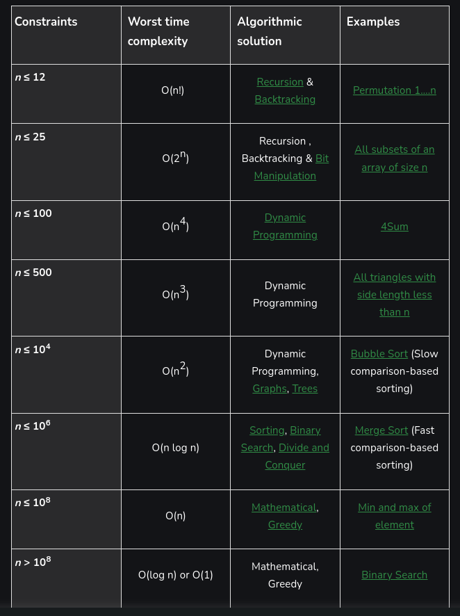

# Tips



- Searching for a key in dict takes only approximately O(1). So instead of list search, this is better. Use dit.get so it will return None without throwing an KeError when no such key exists.
- In a palindrome question use below expand function. With that you can do almost anything. This will return the length of the possible palindrome with i to j centered. For example, expand(i,i) gives odd length palindrome. expand(i,i+1) gives even length palindromes.

```Python3
        def expand(i,j):
            while i>=0 and j<len(s) and s[i]==s[j]:
                i-=1
                j+=1
            return j-1-i

- use enumerate if possible
```Python3
        for i,e in enumerate(s):
            t = i%t1 
            if t<numRows:
                arr[t]+=e
            else:
                arr[t1-t]+=e

- use variables to store and reuse reapplyting calculations no matter how much they are small
- if a solution takes too much lines, it is incorrect. There must be a recursion.
- In a dynamic programming problem, identify how many parametres are there. Is it only m or m,n etc. If there are two such, then most likely, dp is 2D etc.
- Problem 15 - if you are given an array to find n numbers where operation(n1,n2,n3)==target. Use HashMap
- A list can be sorted and iterate usig two pointers for some occasions.
- If you want t create a new list from an existing list use map and/or filter
```Python3
    def removeDuplicates(self, nums: List[int]) -> int:
        nums = list(map(lambda x:nums[x],filter(lambda i:i==0 or nums[i]!=nums[i-1], range(len(nums)))))
        return len(nums)
- With iterables you can use find and index methods. find does not throw ValueError.
- Also remmeber binary shift to do huge calculation like below in binary decsion algorithm
```Python3
    def divide(self, dividend: int, divisor: int) -> int:
        if dividend == -2**31 and divisor == -1:
            return 2**31 - 1
        neg = -1 if dividend > 0 and divisor < 0 or dividend < 0 and divisor > 0 else 1
        dividend=abs(dividend)
        divisor=abs(divisor)
        divisorCount=1
        while dividend>=(divisor<<1):
            divisor<<=1
            divisorCount<<=1
        quo=0
        while divisorCount>0:
            if dividend>=divisor:
                dividend-=divisor
                quo += divisorCount
            divisor>>=1
            divisorCount>>=1
        return quo*neg
- Check out the netx permatuation code (31 in leetcode)
- Try to visualize (E.g. Rotation of a sorted array can be visualized as /|/)
- Use resursion to build combinations or permatuations
```Python3
    def combinationSum(self, candidates: List[int], target: int) -> List[List[int]]:
        out=[]
        for ind,i in enumerate(candidates):
            if target==i:
                out.append([i])
            elif target>i:
                t=self.combinationSum(candidates[ind:], target-i)
                for j in t:
                    out.append(j+[i])
        return out
- When working with duplicates either sort or use a hash map
```Pyton3
    nums.sort()
    for i in range(len(nums)):
        if i==0 or nums[i]!=nums[i-1]:
            backtrack(nums[i+1:])
    # This avoirds the duplicates and deploy backtrack algorithm. REMEMBER REMEMEBR REMEMBER REMEMBER REMEMBER REMEMBER
- Check below two codes for the power of the sort
```Python3
# Before sort
    def combinationSum(self, candidates: List[int], target: int) -> List[List[int]]:
        out=[]
        for ind,i in enumerate(candidates):
            if target==i:
                out.append([i])
            elif target>i:
                t=self.combinationSum(candidates[ind:], target-i)
                for j in t:
                    out.append(j+[i])
        return out
```Python3
# After Sort , More fucntionalitites, more optimizations
class Solution:
    def combinationSum2(self, candidates: List[int], target: int) -> List[List[int]]:
        def comb(candidates, target):
            out=[]
            if not candidates or target<candidates[0]: # This greatly optimizes the code
                return out
            for ind,i in enumerate(candidates):
                if ind==0 or candidates[ind]!=candidates[ind-1]:
                    if target==i:
                        out.append([i])
                    elif target>i:
                        t=comb(candidates[ind+1:], target-i)
                        for j in t:
                            out.append(j+[i])
                    else:   # This also optimizes the code
                        break
            return out
        candidates.sort()
        return comb(candidates, target)
- Use backtracking is easier and faster. That means you sae output at the terminating condition instead of returning it. You build the output while recurring and at the termination it would be finished.
- bitmasking is super powerful in combinations. We convert combination task to binary conversion tasl. Super fast and elegant
- In some cases, you can let a while loop run, making constant changes to an array indx until it sets to an expected value
```Python3
class Solution:
  def firstMissingPositive(self, nums: List[int]) -> int:
    n = len(nums)
    
    for i in range(n):
        while 1<=nums[i]<=n and nums[i]!=nums[nums[i]-1]:
            t = nums[i]
            nums[i]=nums[t-1]
            nums[t-1]=t
            
    
    for i in range(n):
        if nums[i] != i + 1:
            return i + 1
    
    return n + 1
- If you want to find minimum and maximum dynamically on an array dependeing on the index, do not do it in the main itrtation. Instead of that, do a preprocess. With just one iteraton find min and max for all the iterations and use it next.This will reduce O(n)-->O(n)
```Python3
class Solution:
    def trap(self, height: List[int]) -> int:
        left=[0 for i in range(len(height))]
        right=[0 for i in range(len(height))]
        lm=0
        rm=0
        v = 0
        for i in range(len(height)):
            if height[i]>lm:
                lm = height[i]
            left[i]=lm
            if height[-1-i]>rm:
                rm=height[-i-1]
            right[-1-i]=rm
        for i in range(1,len(height)-1):
            h=min(left[i], right[i])
            if h>height[i]:
                v+=(h-height[i])
        return v
- To clockwise rotate a matrix by 90, reverse outer array and get transpose. By 180, reverse indiviual array, and fially the total array. By 270, reverse idnidvidaul arrays and get transpose of total
- use defaultdict to assign intial values for the hash map
```Python3
    from collections import defaultdict
    a=defaultdict(list)
- In a cordinate system, or a chess board or something like that below are the charactristics to idnetify points
    - Same row      =>  same x coordinate
    - Same column   =>  same y coordinate
    - Same main diagonal => same x-y
    - Same anti diagonal => same x+y
    This is useful to solve n queens proble.
- In matrix spiral visit have four variables and chaneg them like below.
```Python3
class Solution:
    def generateMatrix(self, n: int) -> List[List[int]]:
        out=[[None for j in range(n)] for i in range(n)]
        upper=left=0
        lower=right=n-1
        d=n
        c=1
        while upper<=lower:
            for i in range(left, right+1):
                out[upper][i]=c
                c+=1
            upper+=1
            for i in range(upper, lower+1):
                out[i][right]=c
                c+=1
            right-=1
            for i in range(right, left-1,-1):
                out[lower][i]=c
                c+=1
            lower-=1
            for i in range(lower, upper-1, -1):
                out[i][left] = c
                c+=1
            left+=1
        return out
- Number conversion
```Python3
bin(x) # from decima to binary
int(x,2) #from binary to decimal